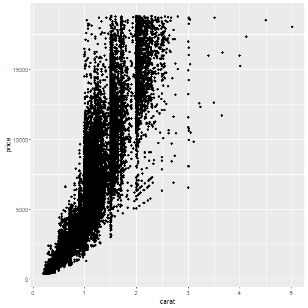

Diamond Price Predictor
========================================================
author: Manni Truong
date: 31/01/2016

Introduction
========================================================

The app uses the `diamonds` dataset which is part of `ggplot2`. We use linear modelling to build a model that can be used to predict the price of a diamond given certain characteristics, such as carat. 

The app can be accessed at [shinyapps](https://mhtruong.shinyapps.io/assignment/)

Exploratory analysis
========================================================

Carat is used as the principal predictor after some exploratory analysis reveals some correlation. The graph below shows the higher the carat number the higher the price. 

Model building
========================================================

To keep things simple we decided to use a linear model with one single predictor. We use the formula: 

$$ P_i = b_0 + b_1 CN_i + e_i $$

where $P_i$ is the price and $CN_i$ is the carat number.

This model is then used to predict based on new values of $CN_i$.

Future iterations of app
========================================================

In future iterations of the app we could extend our model to control for other factors such as `cut` or `clarity`.
The graph below for example hints at how the `cut` variable might improve the prediction.

